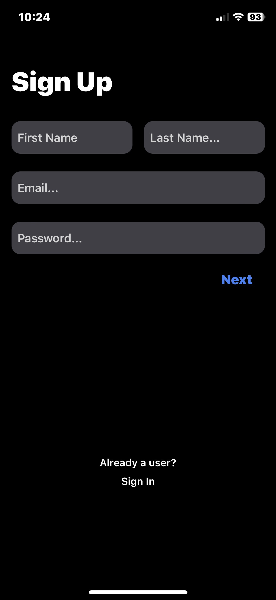
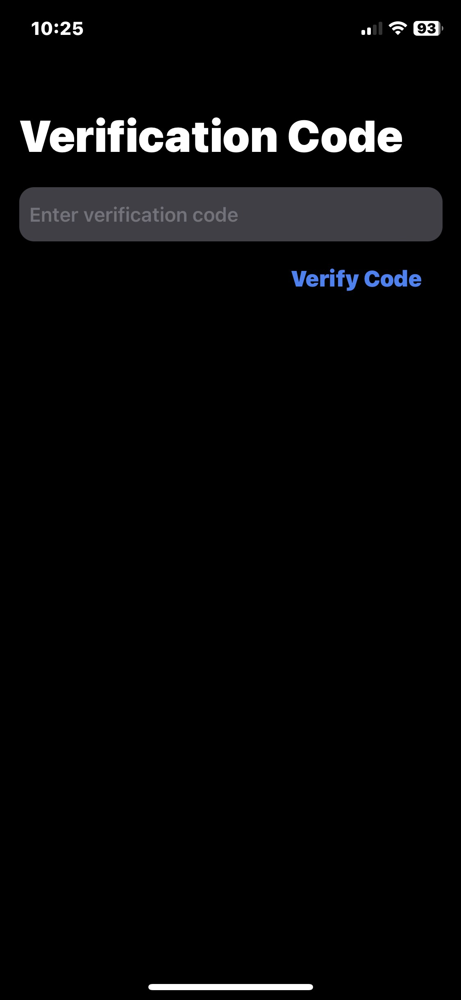
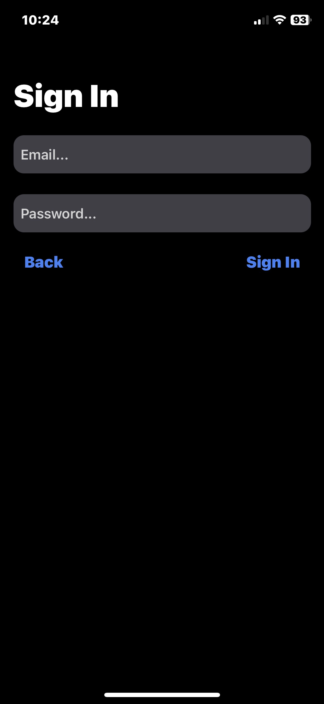

# WhatsLeft
WhatsLeft is a messaging app similar to WhatsApp and Signal made to chat with your friends and family! WhatsLeft was made using the React Native framework in (Expo) and is tailored to IOS and Android only (WhatsLeft is not available on web).

## How I built it
The development stack used to make this project was:

* [React Native](https://reactnative.dev/) for the frontend  
* [Native Wind](https://www.nativewind.dev/) for CSS styling 
* [Expo](https://expo.dev/) for building environment, bundling TS & routing 
* [Clerk](https://clerk.com/) for user authentication 
* [MongoDB](https://www.mongodb.com/) for user database 
* [ExpressJS](https://expressjs.com/) for backend framework 
* [Github](https://github.com/) for version control 
